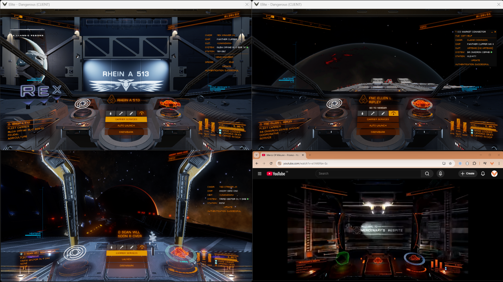

# EDMultiCMDR

Launch multiple Elite Dangerous commanders concurrently from one Windows login using [MinEDLauncher](https://github.com/rfvgyhn/min-ed-launcher) (Steam or Frontier). Have each CMDR use their own set of tools, in their context (like EDMarketConnector and plugins).



## What it does

- Start selected accounts with [MinEDLauncher](https://github.com/rfvgyhn/min-ed-launcher) multi-account support and auto-login.
- Store account metadata in `%LOCALAPPDATA%\EDMultiCMDR\credentials.json` with DPAPI-encrypted passwords.
- Support Steam and Frontier clients, including optional Frontier profiles and per-account `launcherPath` overrides.
- Optionally trigger EDMarketConnector or other tools via MinEDLauncher `processes` hooks.

## Requirements

- Elite Dangerous installed via Steam and/or Frontier launcher (Epic is not supported).
- [MinEDLauncher](https://github.com/rfvgyhn/min-ed-launcher) installed and working for each account (***run it once per account manually to verify***).
- Optional: companion apps such as EDMarketConnector, VoiceAttack, EDDiscovery, or EDDI.
- Windows with PowerShell 5.1 or later (comes pre-installed with Windows 10 and 11)

## Set up MinEDLauncher

- **Steam**: set Steam launch options to `cmd /c "MinEdLauncher.exe %command% /autorun /autoquit"` per the MinEDLauncher Steam instructions.
- **Frontier**: place `MinEdLauncher.exe` next to `EDLaunch.exe`, create a shortcut, and add `/frontier <profile> /autorun /autoquit` to the Target. If MinEDLauncher lives in a non-standard path, record it per account via `launcherPath`.

## Install EDMultiCMDR

1. Download the latest release ZIP from the GitHub releases page.
2. Extract to a folder, e.g. `C:\Program Files\EDMultiCMDR` or `C:\Users\<you>\Apps\EDMultiCMDR`.
3. Create a shortcut that runs `powershell.exe -NoProfile -ExecutionPolicy Bypass -File "C:\path\to\EDMultiCMDR\EDMultiCMDR.ps1"` (optional: set "Start in" to the install folder).

## Configure accounts (first run)

- Run the script; if no credentials exist you will be prompted to add Windows accounts credentials and required launch properties.
- Captured fields: `username`, `password` (encrypted), `client` (`steam` or `frontier`), optional Frontier `profile`, and optional `launcherPath` when the launcher is not in its default location.
- You must provide the Windows user names and passwords of the accounts (local or Microsoft accounts).Windows account's user names and passwords are stored in the same way MinEDLauncher stores your Steam, Frontier and Epic passwords. Pick your poison, and see [notes on security below](#notes-and-security-considerations).
- Credentials are stored at `%LOCALAPPDATA%\EDMultiCMDR\credentials.json` using DPAPI, so they can only be decrypted by the same Windows user on the same machine.
- Use `-EditCredentials` to add or update entries later. Delete the credentials file to start fresh if needed.

## Run the launcher

- Start the script normally or via your shortcut.
- Select which accounts to start (supports comma/range selection or `all`). The script:
  - Detects already-running Elite Dangerous processes.
  - Starts MinEDLauncher for each selected account and waits for the new game process.
  - Closes the launcher process it started (Steam/Frontier) to allow multiple concurrent sessions.
- Useful options: `-Help` (usage), `-Verbose` (diagnostics), `-EditCredentials` (manage accounts only), `-Launch <selection>` (skip the prompt by supplying values like `-Launch 1,3-5` or `-Launch all`).
- Example: `powershell -File .\EDMultiCMDR.ps1 -Launch 2-3` starts the 2nd and 3rd configured commanders immediately. Good for shortcuts.

## Auto-launch companion apps (optional)

- Edit `%LOCALAPPDATA%\min-ed-launcher\settings.json` and populate `"processes"` per the MinEDLauncher docs. Example for EDMarketConnector:

```json
"processes": [
  {
    "fileName": "C:\\Program Files (x86)\\EDMarketConnector\\EDMarketConnector.exe",
    "arguments": "--force-localserver-for-auth"
  }
]
```

- Add further entries for tools like [VoiceAttack](https://voiceattack.com/), [EDDiscovery](https://github.com/EDDiscovery/EDDiscovery/wiki), or [EDDI](https://github.com/EDCD/EDDI) as desired.

## Troubleshooting

- Ensure each Windows account has launched Elite Dangerous at least once directly through its launcher.
- Follow the [MinEDLauncher](https://github.com/rfvgyhn/min-ed-launcher) installation instructions, specifically the [multi-account part](https://github.com/rfvgyhn/min-ed-launcher?tab=readme-ov-file#multi-account).
- Use `-Verbose` to see credential loading, account selection, and process wait details.
- Verify `launcherPath` for Frontier accounts if the script cannot find MinEDLauncher.
- Delete `%LOCALAPPDATA%\EDMultiCMDR\credentials.json` and re-run the script if the credential file becomes corrupted.

## Notes and security considerations

- No external PowerShell modules are required; the implementation uses built-in ConvertFrom-SecureString/ConvertTo-SecureString (DPAPI).
- Because passwords are DPAPI-encrypted, the file is effectively private to your Windows user account on that machine. If you need to move credentials between machines or users you must re-enter them on the target account.
- If you want to reset or reinitialize storage, delete %LOCALAPPDATA%\EDMultiCMDR\credentials.json and re-run the script to create a new credentials file.
- The script stores Windows account entries in a local JSON file under your user profile: %LOCALAPPDATA%\EDMultiCMDR\credentials.json.
- Passwords are not stored in plaintext. When you enter a password the script converts the SecureString to an encrypted string using PowerShell's ConvertFrom-SecureString (DPAPI). The JSON therefore contains encrypted password blobs.
- On use, the script converts the encrypted blob back to a SecureString (ConvertTo-SecureString) and builds a PSCredential to pass to Start-Process -Credential. At no point does the script write raw plaintext passwords to disk.
- The DPAPI encryption ties the stored password string to your Windows user account and machine. That means the encrypted strings can only be decrypted by the same Windows user on the same machine.

## License

MIT License (see `LICENSE`).
